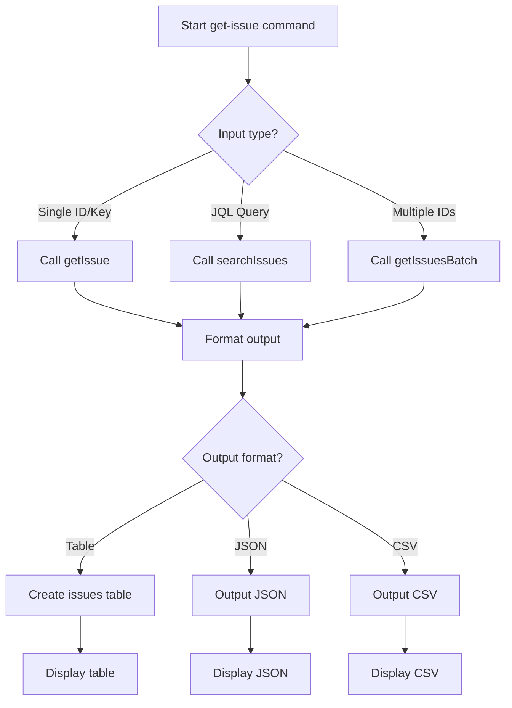
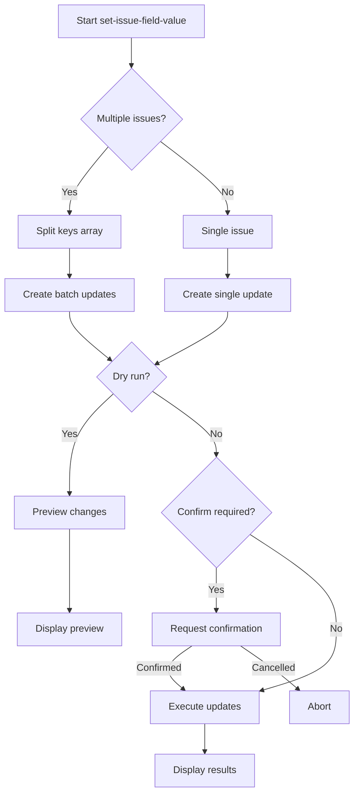
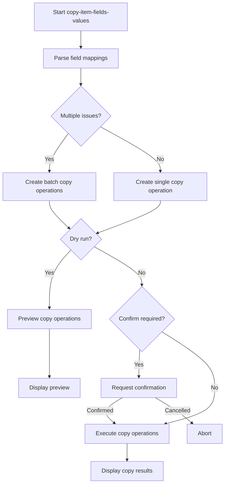

# Jira Issue Commands Architecture Design

## Overview
This document outlines the architecture design for three new Jira issue commands to be added to the existing Jira Admin CLI codebase. The design follows existing patterns and integrates seamlessly with the current modular structure.

## Current Architecture Analysis

### Key Patterns Identified
1. **Modular Structure**: Commands in `src/commands/commands.js`, Jira API in `src/services/jiraApi.js`, utilities in `src/utils/`
2. **Commander.js Integration**: CLI commands defined in `index.js` with consistent option patterns
3. **Configuration Management**: Encrypted config loaded in each command via `loadConfig()`
4. **Timeout Protection**: All commands use 120-second timeout via `applyTimeoutToObject`
5. **Batch Operations**: Support for comma-separated IDs with success/failure tracking
6. **Table Formatting**: Consistent table output using `cli-table3` with utilities in `src/utils/table.js`
7. **Loader Pattern**: Visual feedback during operations using `src/utils/loader.js`
8. **Error Handling**: Consistent error handling with user-friendly messages

### Existing JiraApi Methods Pattern
```javascript
async methodName(params) {
    // Implementation with axios calls
    // Consistent error handling
    // Returns data or array of results
}
```

## New JiraApi Extensions Design

### 1. Issue Retrieval Methods

#### `getIssue(issueIdOrKey, options = {})`
```javascript
/**
 * Retrieve a single issue by ID or key
 * @param {string} issueIdOrKey - Issue ID (numeric) or key (e.g., PROJ-123)
 * @param {Object} options - Optional parameters
 * @param {string} options.fields - Comma-separated list of fields to include
 * @param {string} options.expand - Comma-separated list of expansions
 * @param {Array} options.properties - Properties to include
 * @returns {Object} Issue data
 */
```

#### `searchIssues(jql, options = {})`
```javascript
/**
 * Search issues using JQL
 * @param {string} jql - JQL query string
 * @param {Object} options - Optional parameters
 * @param {number} options.startAt - Pagination start index
 * @param {number} options.maxResults - Maximum results per page
 * @param {string} options.fields - Comma-separated list of fields
 * @param {string} options.expand - Comma-separated list of expansions
 * @returns {Array} Array of issues matching the query
 */
```

#### `getIssuesBatch(issueIdsOrKeys, options = {})`
```javascript
/**
 * Retrieve multiple issues by IDs or keys
 * @param {Array} issueIdsOrKeys - Array of issue IDs or keys
 * @param {Object} options - Optional parameters
 * @param {string} options.fields - Comma-separated list of fields
 * @param {string} options.expand - Comma-separated list of expansions
 * @returns {Array} Array of results with success/failure status
 */
```

### 2. Issue Field Update Methods

#### `updateIssueField(issueIdOrKey, fieldId, value)`
```javascript
/**
 * Update a single field on an issue
 * @param {string} issueIdOrKey - Issue ID or key
 * @param {string} fieldId - Field ID (e.g., 'summary', 'customfield_10010')
 * @param {string|Object} value - Field value (string for text fields)
 * @returns {Object} Update result
 */
```

#### `updateIssueFieldsBatch(issueUpdates)`
```javascript
/**
 * Update fields on multiple issues
 * @param {Array} issueUpdates - Array of update objects
 * @param {string} issueUpdates[].issueIdOrKey - Issue ID or key
 * @param {string} issueUpdates[].fieldId - Field ID
 * @param {string} issueUpdates[].value - Field value
 * @returns {Array} Array of results with success/failure status
 */
```

### 3. Field Copy Methods

#### `copyFieldValue(sourceIssueIdOrKey, targetIssueIdOrKey, sourceFieldId, targetFieldId, options = {})`
```javascript
/**
 * Copy field value from one issue to another
 * @param {string} sourceIssueIdOrKey - Source issue ID or key
 * @param {string} targetIssueIdOrKey - Target issue ID or key
 * @param {string} sourceFieldId - Source field ID
 * @param {string} targetFieldId - Target field ID
 * @param {Object} options - Optional parameters
 * @param {boolean} options.append - Append instead of replace (default: false)
 * @param {string} options.separator - Separator for append mode (default: ', ')
 * @returns {Object} Copy result
 */
```

#### `copyFieldValuesBatch(copyOperations)`
```javascript
/**
 * Copy field values in batch operations
 * @param {Array} copyOperations - Array of copy operation objects
 * @param {string} copyOperations[].sourceIssueIdOrKey - Source issue
 * @param {string} copyOperations[].targetIssueIdOrKey - Target issue
 * @param {string} copyOperations[].sourceFieldId - Source field
 * @param {string} copyOperations[].targetFieldId - Target field
 * @param {Object} copyOperations[].options - Copy options
 * @returns {Array} Array of results with success/failure status
 */
```

## Command Architecture Design

### 1. `get-issue` Command

#### CLI Options
```
jira-cli get-issue [options] <issue-query>

Options:
  -i, --issue <issue>        Issue ID or key (e.g., PROJ-123)
  -j, --jql <jql>            JQL query to search for issues
  -k, --keys <keys>          Comma-separated issue keys/IDs
  -f, --fields <fields>      Comma-separated list of fields to include
  -e, --expand <expand>      Comma-separated list of expansions
  -o, --output <format>      Output format: table, json, csv (default: table)
  --max-results <number>     Maximum results for JQL queries (default: 50)
  --raw                      Output raw JSON response
  -u, --url <url>            Jira instance URL
  -e, --email <email>        Jira user email
  -t, --token <token>        Jira API token
```

#### Command Logic Flow


#### Implementation Pattern
```javascript
async function getIssue(config, options) {
    const Loader = require('../utils/loader');
    const loader = new Loader('Fetching issue data');
    loader.start();

    try {
        const jira = new JiraApi(config.url, config.email, config.token);
        let issues = [];
        
        if (options.issue) {
            // Single issue
            const issue = await jira.getIssue(options.issue, {
                fields: options.fields,
                expand: options.expand
            });
            issues = [issue];
        } else if (options.jql) {
            // JQL search
            issues = await jira.searchIssues(options.jql, {
                fields: options.fields,
                expand: options.expand,
                maxResults: options.maxResults || 50
            });
        } else if (options.keys) {
            // Multiple issues
            const issueKeys = options.keys.split(',').map(k => k.trim());
            const results = await jira.getIssuesBatch(issueKeys, {
                fields: options.fields,
                expand: options.expand
            });
            issues = results.filter(r => r.success).map(r => r.data);
        }
        
        loader.stop();
        
        // Format output based on options
        if (options.raw || options.output === 'json') {
            console.log(JSON.stringify(issues, null, 2));
        } else if (options.output === 'csv') {
            // CSV output logic
        } else {
            // Default table output
            const { createIssuesTable } = require('../utils/table');
            console.log(createIssuesTable(issues));
        }
    } catch (error) {
        loader.stop();
        throw error;
    }
}
```

### 2. `set-issue-field-value` Command

#### CLI Options
```
jira-cli set-issue-field-value [options]

Options:
  -i, --issue <issue>        Issue ID or key (required)
  -k, --keys <keys>          Comma-separated issue keys/IDs
  -f, --field <field>        Field ID (e.g., summary, customfield_10010) (required)
  -v, --value <value>        Field value (required)
  --dry-run                  Preview changes without applying
  --confirm                  Require confirmation before applying
  -u, --url <url>            Jira instance URL
  -e, --email <email>        Jira user email
  -t, --token <token>        Jira API token
```

#### Command Logic Flow


#### Implementation Pattern
```javascript
async function setIssueFieldValue(config, options) {
    const jira = new JiraApi(config.url, config.email, config.token);
    
    // Prepare updates
    const updates = [];
    if (options.keys) {
        const issueKeys = options.keys.split(',').map(k => k.trim());
        updates.push(...issueKeys.map(key => ({
            issueIdOrKey: key,
            fieldId: options.field,
            value: options.value
        })));
    } else if (options.issue) {
        updates.push({
            issueIdOrKey: options.issue,
            fieldId: options.field,
            value: options.value
        });
    }
    
    if (options.dryRun) {
        // Preview mode
        console.log(`Would update ${updates.length} issue(s):`);
        updates.forEach(update => {
            console.log(`  ${update.issueIdOrKey}: ${update.fieldId} = "${update.value}"`);
        });
        return;
    }
    
    if (options.confirm && updates.length > 0) {
        const readline = require('readline');
        const rl = readline.createInterface({
            input: process.stdin,
            output: process.stdout
        });
        
        const answer = await new Promise(resolve => {
            rl.question(`Confirm updating ${updates.length} issue(s)? (Y/N): `, resolve);
        });
        rl.close();
        
        if (answer.toUpperCase() !== 'Y') {
            console.log('Operation cancelled.');
            return;
        }
    }
    
    // Execute updates
    const results = await jira.updateIssueFieldsBatch(updates);
    
    // Display results
    console.log(`Results (${results.length} updates):`);
    console.log('='.repeat(60));
    results.forEach(result => {
        if (result.success) {
            console.log(`✓ ${result.issueIdOrKey}: ${result.fieldId} updated successfully`);
        } else {
            console.log(`✗ ${result.issueIdOrKey}: ${result.fieldId} failed - ${result.error}`);
        }
    });
}
```

### 3. `copy-item-fields-values` Command

#### CLI Options
```
jira-cli copy-item-fields-values [options]

Options:
  -s, --source <source>      Source issue ID or key (required)
  -t, --target <target>      Target issue ID or key (required)
  --sources <sources>        Comma-separated source issue keys/IDs
  --targets <targets>        Comma-separated target issue keys/IDs
  -f, --field <field>        Single field ID to copy
  --fields <fields>          Comma-separated field IDs to copy
  --field-map <map>          Field mapping: source1:target1,source2:target2
  --append                   Append values instead of replacing
  --separator <separator>    Separator for append mode (default: ', ')
  --dry-run                  Preview changes without applying
  --confirm                  Require confirmation before applying
  -u, --url <url>            Jira instance URL
  -e, --email <email>        Jira user email
  -t, --token <token>        Jira API token
```

#### Command Logic Flow


#### Implementation Pattern
```javascript
async function copyItemFieldsValues(config, options) {
    const jira = new JiraApi(config.url, config.email, config.token);
    
    // Parse field mappings
    const fieldMappings = [];
    if (options.fieldMap) {
        // Parse source:target pairs
        options.fieldMap.split(',').forEach(pair => {
            const [sourceField, targetField] = pair.split(':').map(f => f.trim());
            if (sourceField && targetField) {
                fieldMappings.push({ sourceField, targetField });
            }
        });
    } else if (options.fields) {
        // Same field names for source and target
        options.fields.split(',').forEach(field => {
            fieldMappings.push({ sourceField: field.trim(), targetField: field.trim() });
        });
    } else if (options.field) {
        // Single field
        fieldMappings.push({ sourceField: options.field, targetField: options.field });
    }
    
    // Prepare copy operations
    const copyOperations = [];
    
    if (options.sources && options.targets) {
        // Batch mode: multiple sources to multiple targets
        const sources = options.sources.split(',').map(s => s.trim());
        const targets = options.targets.split(',').map(t => t.trim());
        
        // Create cartesian product or 1:1 mapping based on count
        const maxLength = Math.max(sources.length, targets.length);
        for (let i = 0; i < maxLength; i++) {
            const source = sources[i % sources.length];
            const target = targets[i % targets.length];
            
            fieldMappings.forEach(mapping => {
                copyOperations.push({
                    sourceIssueIdOrKey: source,
                    targetIssueIdOrKey: target,
                    sourceFieldId: mapping.sourceField,
                    targetFieldId: mapping.targetField,
                    options: {
                        append: options.append,
                        separator: options.separator || ', '
                    }
                });
            });
        }
    } else if (options.source && options.target) {
        // Single source to single target
        fieldMappings.forEach(mapping => {
            copyOperations.push({
                sourceIssueIdOrKey: options.source,
                targetIssueIdOrKey: options.target,
                sourceFieldId: mapping.sourceField,
                targetFieldId: mapping.targetField,
                options: {
                    append: options.append,
                    separator: options.separator || ', '
                }
            });
        });
    }
    
    if (options.dryRun) {
        // Preview mode
        console.log(`Would copy ${copyOperations.length} field value(s):`);
        copyOperations.forEach(op => {
            console.log(`  ${op.sourceIssueIdOrKey}:${op.sourceFieldId} -> ${op.targetIssueIdOrKey}:${op.targetFieldId}`);
            if (op.options.append) {
                console.log(`    Mode: Append (separator: "${op.options.separator}")`);
            } else {
                console.log(`    Mode: Replace`);
            }
        });
        return;
    }
    
    if (options.confirm && copyOperations.length > 0) {
        const readline = require('readline');
        const rl = readline.createInterface({
            input: process.stdin,
            output: process.stdout
        });
        
        const answer = await new Promise(resolve => {
            rl.question(`Confirm copying ${copyOperations.length} field value(s)? (Y/N): `, resolve);
        });
        rl.close();
        
        if (answer.toUpperCase() !== 'Y') {
            console.log('Operation cancelled.');
            return;
        }
    }
    
    // Execute copy operations
    const results = await jira